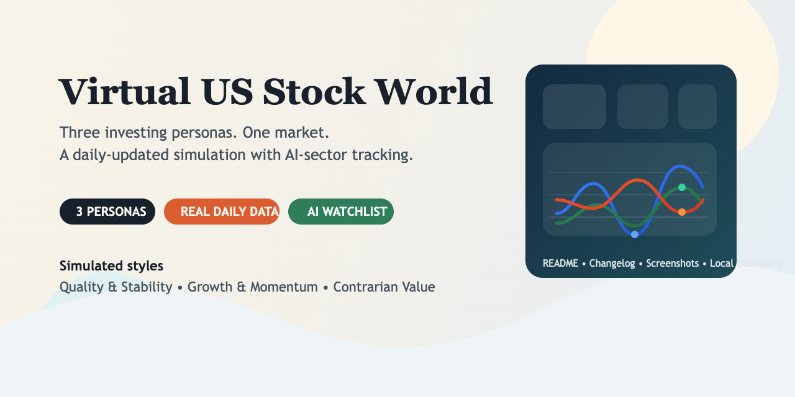
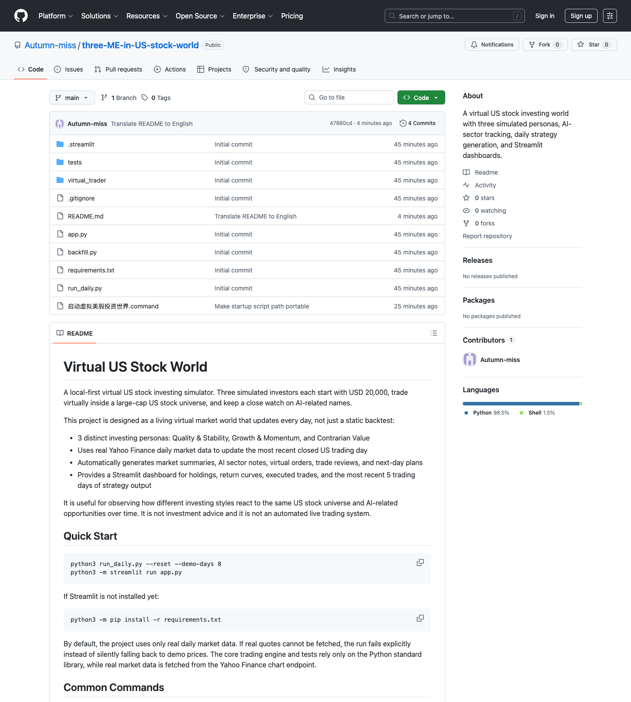
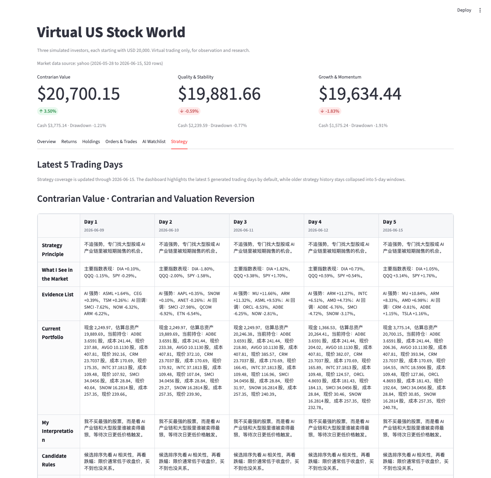
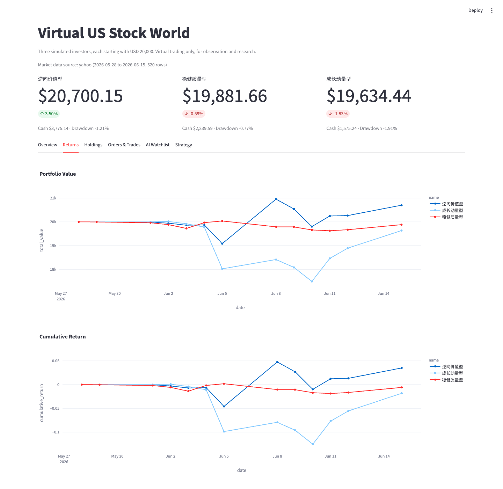
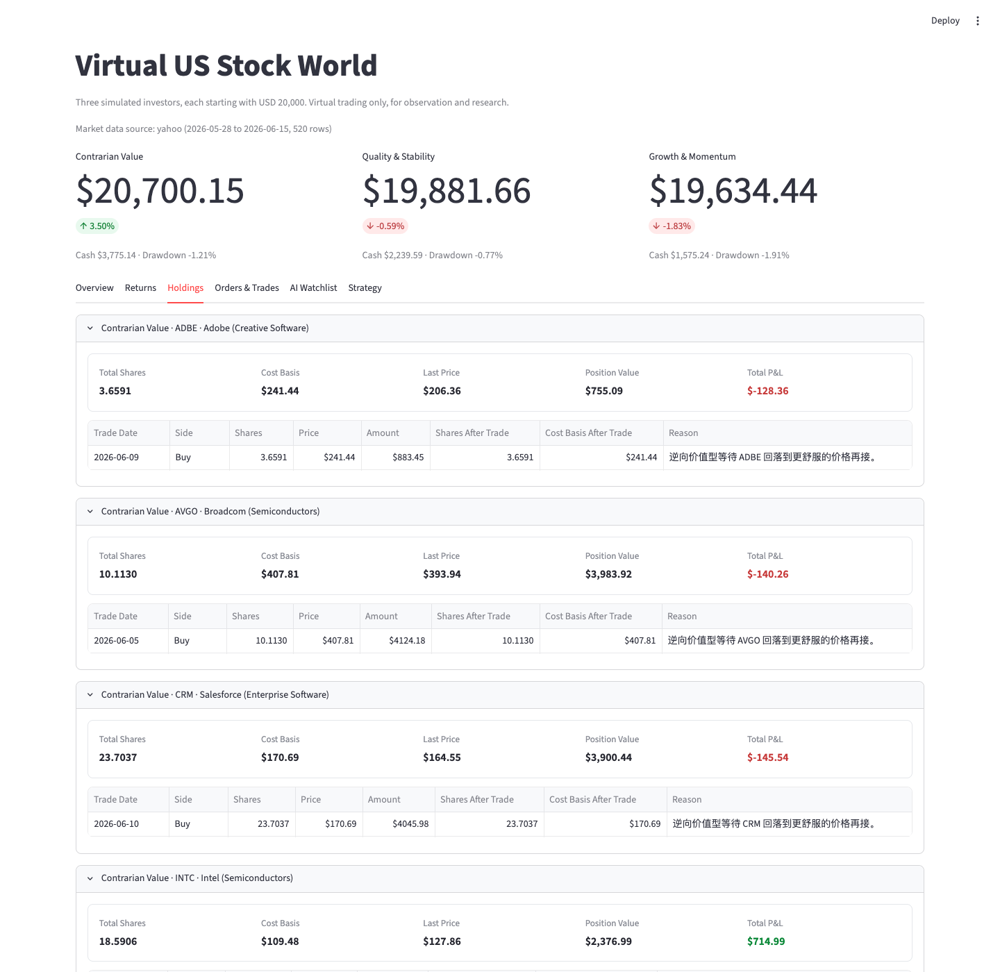
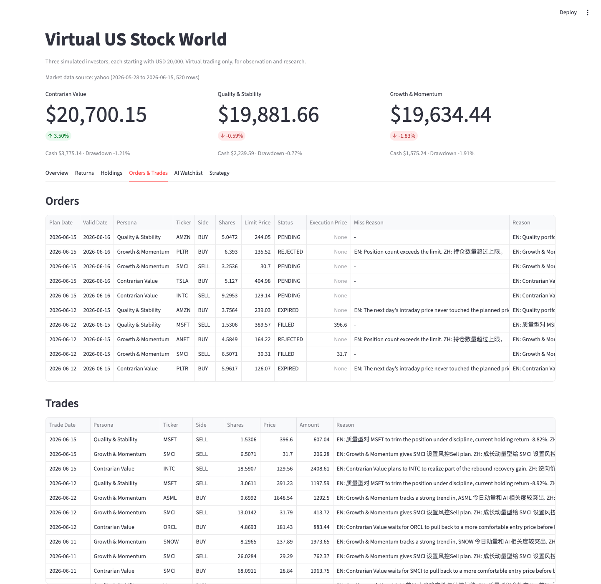

# Virtual US Stock World



**Three investing personas. One market. A daily-updated simulation.**

A local-first, explainable US stock simulation where three distinct investing personas react to the same market every trading day, with a close watch on AI-related names.

This project is designed as a living virtual market world that updates every day, not just a static backtest.

Latest project history is tracked in [CHANGELOG.md](CHANGELOG.md).

## What This Project Does

- Simulates 3 distinct investing personas: Quality & Stability, Growth & Momentum, and Contrarian Value
- Updates the most recent closed US trading day with real daily market data
- Executes virtual limit orders based on each persona's own decision rules
- Generates daily market summaries, AI sector notes, trade reviews, and next-day plans
- Visualizes holdings, return curves, trades, and recent strategy output in a Streamlit dashboard

This repository is for simulation, observation, and research. It is not investment advice and it is not an automated live trading system.

## Features

- Multi-persona simulation: compare how different investing styles react to the same market environment
- AI-sector focus: track AI-related US stocks alongside broader large-cap names
- Daily workflow: prices, order execution, reporting, and strategy generation in one repeatable process
- Real-data-first design: the default run fails explicitly if real quotes cannot be fetched
- Recent strategy emphasis: the dashboard highlights the latest 5 trading days and collapses older history
- Local-first setup: runs on your own machine with a SQLite database and Streamlit UI
- Language toggle: switch dashboard content between `English`, `Bilingual`, and `Chinese`

## How It Works

1. `run_daily.py` finds the latest closed US trading day that still needs to be processed, skipping US market holidays.
2. The system fetches daily OHLC data from Yahoo Finance, with Stooq as a secondary real-data source.
3. Pending virtual orders are evaluated and executed against the daily price range.
4. Each persona generates a new interpretation of the market and a new action plan.
5. Portfolio snapshots, reports, and strategy records are written into the local SQLite database.
6. `app.py` reads the database and presents the latest state in the Streamlit dashboard.

## Screenshots

### GitHub Repository Overview



The repository homepage shows the English project summary, setup instructions, and supporting metadata for open-source visitors.

### Strategy Dashboard



This strategy view shows the English page title, top navigation, persona ranking cards, and a strategy section that can switch between English, bilingual, and Chinese display.

### Returns Dashboard



The dashboard UI is being translated progressively into English, starting with the page title, top navigation, and key section headers.

### Holdings Dashboard



The holdings view now uses English persona labels, English style names, and fully English field labels for position summaries and trade history.

### Orders and Trades Dashboard



The orders and trades view now uses English table headers plus bilingual `EN / ZH` reasoning fields for planned orders and executions.

## Quick Start

```bash
python3 run_daily.py --reset --demo-days 8
python3 -m streamlit run app.py
```

If Streamlit is not installed yet:

```bash
python3 -m pip install -r requirements.txt
```

Open the dashboard locally at [http://localhost:8501](http://localhost:8501).

## Common Commands

```bash
python3 run_daily.py
python3 run_daily.py --date 2026-05-30
python3 run_daily.py --reset --demo-days 30
python3 backfill.py --days 30
python3 -m unittest discover -s tests
```

Use synthetic demo prices only when you intentionally want an offline product demo:

```bash
python3 run_daily.py --reset --demo-days 30 --allow-synthetic
```

By default, the project uses only real daily market data. If real quotes cannot be fetched, the run fails explicitly instead of silently falling back to demo prices.

## Demo Flow

1. Run `python3 run_daily.py --reset --demo-days 8` to generate a clean demo dataset.
2. Start the dashboard with `python3 -m streamlit run app.py`.
3. Open [http://localhost:8501](http://localhost:8501).
4. Review the `Overview`, `Returns`, `Holdings`, `Orders & Trades`, and `Strategy` tabs in order.
5. Run `python3 run_daily.py` again on later days to extend the virtual market timeline.

## Project Structure

- `app.py`: Streamlit dashboard
- `run_daily.py`: daily workflow entry point
- `backfill.py`: backfills multiple days of real market data
- `virtual_trader/`: database, market data, strategies, execution engine, and daily report logic
- `tests/`: trading-rule test suite
- `assets/screenshots/`: README images for GitHub presentation

## Data Model and Limits

- Default database: `data/virtual_trader.sqlite3`
- Default starting capital per simulated investor: `USD 20,000`
- Long-only stock trading, with no shorting, leverage, margin, or options
- Daily execution is approximated from OHLC ranges rather than tick or minute-level data
- The core trading engine and tests rely only on the Python standard library
- Real market data is fetched from the Yahoo Finance chart endpoint, with Stooq as a secondary source

## Roadmap

- Translate the Streamlit dashboard UI into English
- Add richer performance analytics by persona and sector
- Expand screenshot coverage for holdings, orders, and return curves
- Improve daily report formatting and export options
- Add deployment and sharing options beyond local-only usage

## Notes for Contributors

- The repository is public and open to suggestions, issues, and pull requests
- The local database, logs, and secrets are intentionally excluded from Git tracking
- When real market data is unavailable from the configured sources, the default behavior is to fail rather than hide the problem

## License

This project is released under the MIT License. See `LICENSE` for details.
